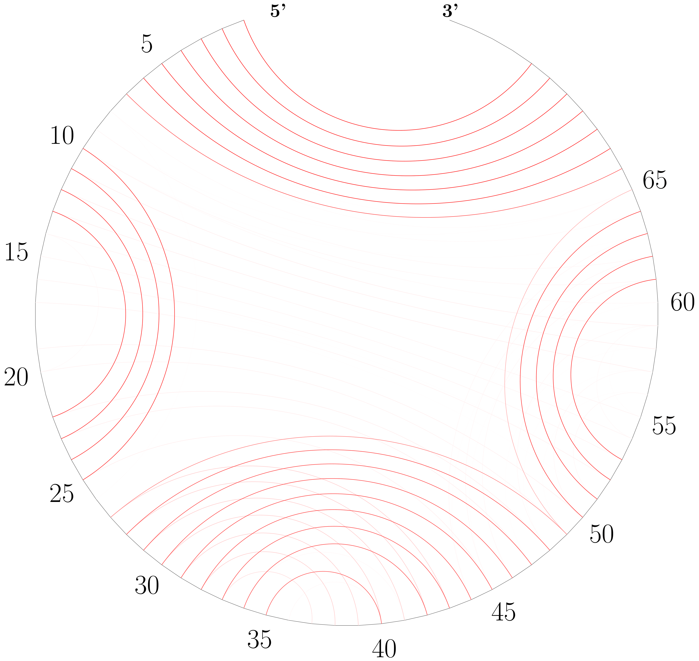
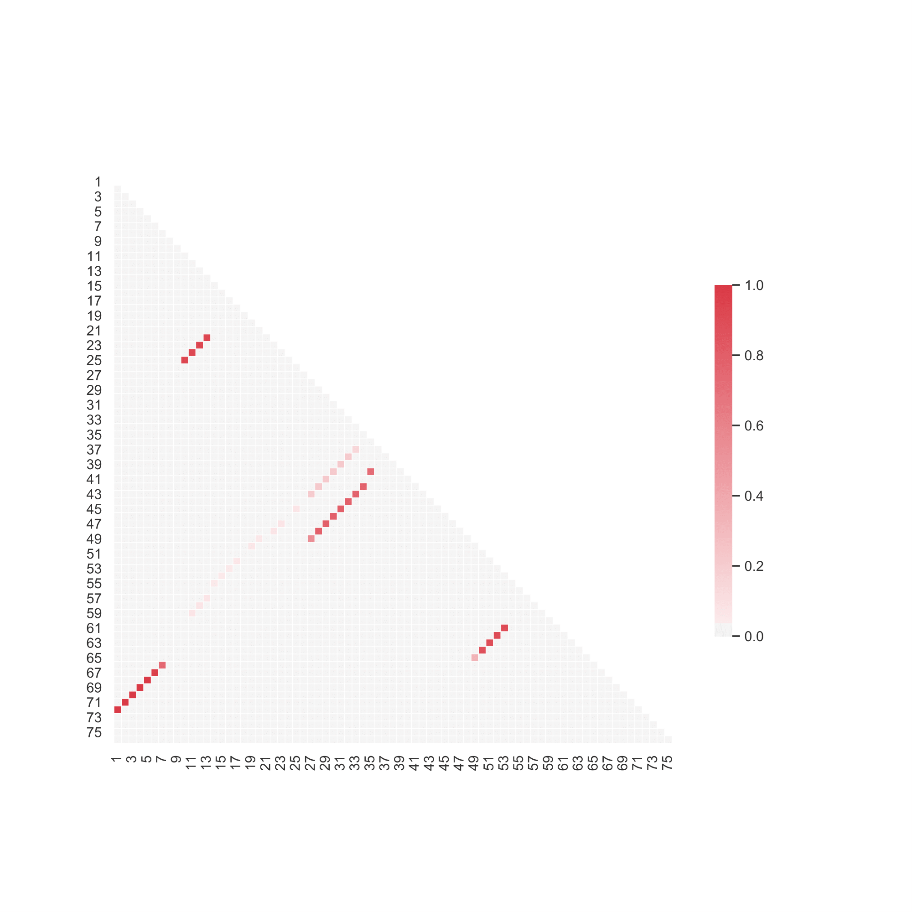

# LinearPartition: Linear-Time Approximation of RNA Folding Partition Function and Base Pairing Probabilities

This repository contains the C++ source code for the LinearPartition project, the first linear-time partition function and base pair probabilities calculation algorithm/software for RNA secondary structures.

[LinearPartition: linear-time approximation of RNA folding partition function and base-pairing probabilities](https://academic.oup.com/bioinformatics/article/36/Supplement_1/i258/5870487). Bioinformatics, Volume 36, Issue Supplement_1, July 2020, Pages i258–i267. ISMB 2020

He Zhang, Liang Zhang, David Mathews, Liang Huang*

\* corresponding author

Web server: http://linearfold.org/partition

---

## Installation and Setup

This repository includes both the LinearPartition C++ code and Python wrappers for mRNA codon optimization. Follow these steps to install and set up the environment.

### System Requirements

- **C++ Compiler**: g++ 4.8.5 or above (or clang++)
- **Python**: Python 3.6 or above
- **Operating System**: Linux, macOS, or Windows (with appropriate tools)

### Step 1: Clone or Download the Repository

```bash
cd /path/to/your/directory
# If using git:
git clone <repository-url>
cd LinearPartitionStefano
```

### Step 2: Compile the C++ LinearPartition Binaries

The Python wrapper requires the compiled LinearPartition executables. Compile them using:

```bash
make linearpartition
```

This will:
- Create a `bin/` directory
- Compile `bin/linearpartition_v` (Vienna parameters version)
- Compile `bin/linearpartition_c` (CONTRAfold parameters version)
- Make the `linearpartition` Python script executable

**Available Makefile targets:**
- `make linearpartition` - Build command-line executables (required)
- `make liblinearpartition` - Build native shared library (recommended for performance)
- `make clean` - Remove all compiled binaries and libraries
- `make all` or `make` - Build both executables and native library

**Note**: You may see some compiler warnings about variable-length arrays. These are safe to ignore and won't affect functionality.

**Troubleshooting**:
- If `make` is not found, install build-essential (Linux) or Xcode Command Line Tools (macOS)
- If compilation fails, ensure you have g++ or clang++ installed
- On macOS, you may need: `xcode-select --install`

### Step 2b: Compile the Native Shared Library (Recommended for Performance)

For optimal performance, especially during optimization runs, you can compile LinearPartition as a native shared library that Python can call directly without spawning subprocesses. This eliminates process creation overhead and significantly speeds up repeated calculations.

**Compile the native library:**

```bash
make liblinearpartition
```

This will:
- Create a `build/` directory for object files
- Compile `liblinearpartition_v.dylib` (macOS) or `liblinearpartition_v.so` (Linux) - Vienna parameters version
- The library is automatically detected and used by the Python wrapper when available

**What gets built:**
- `liblinearpartition_v.dylib` (macOS) or `liblinearpartition_v.so` (Linux) - Native shared library
- Object files in `build/` directory

**Automatic Usage:**
The Python wrapper (`linearpartition_wrapper.py`) automatically detects and uses the native library when:
- Vienna parameters are enabled (`use_vienna=True`, which is the default)
- The library file exists in the repository root
- The library can be successfully loaded

If the native library is not available or fails to load, the wrapper automatically falls back to using the command-line executables, so your code will work either way.

**Benefits of Native Library:**
- **10-100x faster** for repeated calculations (no subprocess overhead)
- **No verbose output** - suppresses "Free Energy of Ensemble" printouts during optimization
- **In-process execution** - all calculations happen in the same Python process
- **Lower memory overhead** - no separate process creation

**Requirements:**
- Same as Step 2: g++ 4.8.5+ or clang++
- On macOS: Universal binaries are built (arm64 + x86_64) for compatibility
- On Linux: Standard shared library (.so) is built

**Troubleshooting Native Library:**
- **"LinearPartition native library not found"**: Run `make liblinearpartition` to build it
- **"mach-o file, but is an incompatible architecture"**: Rebuild with `make clean && make liblinearpartition`
- **Library loads but functions fail**: Check that you're using Vienna parameters (`use_vienna=True`)
- **To force subprocess mode**: Set environment variable `LINEARPARTITION_NATIVE_LIB=""` or ensure the library file doesn't exist

**Custom Library Path:**
You can specify a custom library path using the environment variable:
```bash
export LINEARPARTITION_NATIVE_LIB=/path/to/liblinearpartition_v.dylib
python optimise_mRNA.py
```

**Verify Native Library:**
```bash
# Test that native library is being used
python3 -c "from linearpartition_wrapper import LinearPartitionWrapper; lp = LinearPartitionWrapper(); print('Native client:', lp._native_client is not None)"
```

### Step 3: Install Python Dependencies

Install the required Python packages:

```bash
pip install numpy
```

**Optional dependencies** (for advanced features):
- `biotite` - For downloading PDB sequences in `optimise_mRNA.py`
  ```bash
  pip install biotite
  ```
- `pandas`, `seaborn`, `matplotlib` - For visualization scripts
  ```bash
  pip install pandas seaborn matplotlib
  ```
- `LaTeX` - For drawing circular plots (system-level installation required)

### Step 4: Verify Installation

Test that everything is working:

```bash
# Test LinearPartition directly
echo "GGGCUCGUAGAUCAGCGGUAGAUCGCUUCCUUCGCAAGGAAGCCCUGGGUUCAAAUCCCAGCGAGUCCACCA" | ./linearpartition -V -p

# Test Python wrapper (will use native library if available)
python3 -c "from linearpartition_wrapper import LinearPartitionWrapper; lp = LinearPartitionWrapper(); print('✓ LinearPartition wrapper works')"

# Check if native library is being used
python3 -c "from linearpartition_wrapper import LinearPartitionWrapper; lp = LinearPartitionWrapper(); print('Using native library:', lp._native_client is not None)"

# Test mRNA class
python3 -c "from mRNA import mRNA; from codons import human_aa_to_codon_cai; print('✓ mRNA class works')"
```

---

## Usage: mRNA Codon Optimization

The main functionality is provided through the `mRNA` class in `mRNA.py`, which uses LinearPartition for RNA folding calculations.

### Quick Start Example

```python
from mRNA import mRNA
from codons import human_aa_to_codon_cai
import numpy as np

# Define your nucleotide sequence (must be divisible by 3, contain AUG start codon)
sequence = "AUGAAACCCGGGUUUAAGGCGGCGGAGGACGGGUAA"

# Set loss function weights
weights = {
    'mfe': 1.0,      # Minimum free energy
    'fe': 0.0,       # Ensemble free energy (use either mfe or fe, not both)
    'cai': 1.0,      # Codon Adaptation Index
    'cpg': 1.0,      # CpG dinucleotide count
    'stem': 0.0,     # Stem length penalty
    'utr_hybridisation': 0.0,
    'initial_hybridisation': 0.0,
}

# Create mRNA object
system = mRNA(
    sequence=sequence,
    species='human',  # Options: 'human', 'mouse', 'rat', 'yeast', 'e_coli', 'other'
    aa_to_codon_cai=human_aa_to_codon_cai,
    loss_weights=weights,
    T_K=310,  # Temperature in Kelvin
    verbose=False
)

# Calculate properties
print(f"Free energy: {system.free_energy}")
print(f"Structure: {system.structure}")
print(f"CAI: {np.exp(system.calculate_CAI_log)}")

# Run optimization
system.optimize_codon_usage(
    T_opt=0.3,           # Initial temperature for simulated annealing
    nsteps=100,          # Number of optimization steps (multiplied by number of codons)
    sample_frequency=10, # Frequency of progress output
    output_filename="opt_statistics.txt"
)
```

### Running the Example Script

The `optimise_mRNA.py` script demonstrates optimization of a protein sequence:

```bash
python3 optimise_mRNA.py
```

This script:
1. Downloads a protein sequence from PDB (requires `biotite`)
2. Converts it to a nucleotide sequence
3. Optimizes codon usage using simulated annealing
4. Saves statistics and results

**Note**: Requires internet connection for PDB download on first run.

### Key Features

- **Partition Function Calculation**: Uses LinearPartition for fast ensemble free energy calculation
- **Base Pair Probability Matrix**: Computes full BPP matrix for structure analysis
- **Structure Prediction**: Uses MEA (Maximum Expected Accuracy) structure from LinearPartition
- **Codon Optimization**: Simulated annealing optimization with customizable loss function
- **Multiple Species Support**: Pre-configured CAI values for human, mouse, rat, yeast, E. coli
- **Native Library Integration**: Optional in-process native library for 10-100x faster repeated calculations (see Step 2b)

### Loss Function Components

The optimization minimizes a weighted loss function with these components:

- `mfe`: Minimum free energy (per codon, normalized)
- `fe`: Ensemble free energy (per codon, normalized) - alternative to mfe
- `cai`: Negative log of Codon Adaptation Index (higher CAI = better)
- `cpg`: Count of CpG dinucleotides
- `stem`: Penalty for long stems (>30 bp)
- `utr_hybridisation`: Hybridization probability in UTR region
- `initial_hybridisation`: Hybridization probability in initial region

### Output Files

During optimization, the following files are created:

- `opt_statistics.txt`: Step-by-step statistics (step, acceptance rate, sequence identity)
- `loss_components.{step}`: Detailed loss component values at each sampling step
- `prob_matrix.{step}`: Base pair probability matrices (if enabled)
- `structure.{step}`: Secondary structures in dot-bracket notation (if enabled)
- `structure.{step}.svg.txt`: Structure files for visualization (if enabled)

---

## Dependencies (Detailed)

### C++ Dependencies
- **g++** 4.8.5 or above (or clang++)
- **Make** utility

### Python Dependencies
- **numpy**: Required for numerical operations
- **biotite**: Optional, for PDB sequence download
- **pandas, seaborn, matplotlib**: Optional, for visualization

### System Dependencies (Optional)
- **LaTeX**: For circular plot generation

---

## LinearPartition Command-Line Usage

LinearPartition can be run directly from the command line:
```
echo SEQUENCE | ./linearpartition [OPTIONS]

OR

cat SEQ_OR_FASTA_FILE | ./linearpartition [OPTIONS]
```
Both FASTA format and pure-sequence format are supported for input.

OPTIONS:
```
--beamsize BEAM_SIZE or -b BEAM_SIZE 
```
The beam size (default 100). Use 0 for infinite beam.
```
--Vienna or -V
```
Switches LinearPartition-C (by default) to LinearPartition-V.
```
--fasta
```
Specify that the input is in fasta format. (default FALSE)
```
--verbose
```
Prints out beamsize, Log Partition Coefficient or free energy of ensemble (-V mode) and runtime information. (default False)
```
--sharpturn
```
Enable sharpturn. (default False)
```
--output FILE_NAME or -o FILE_NAME
```
Outputs base pairing probability matrix to a file with user specified name. (default False)
```
--rewrite FILE_NAME or -r FILE_NAME
```
Output base pairing probability matrix to a file with user specified name (overwrite if the file exists). (default False)
```
--prefix PREFIX_NAME
```
Outputs base pairing probability matrices to files with user specified prefix. (default False)
```
--part or -p
```
Partition function calculation only. (default False)
```
--cutoff CUTOFF or -c CUTOFF
```
Only output base pair probability larger than user specified threshold (CUTOFF) between 0 and 1. (DEFAULT=0.0)
```

--dumpforest or -f
```
dump forest (all nodes with inside [and outside] log partition functions but no hyperedges) for downstream tasks such as sampling and accessibility (DEFAULT=None)

```
--mea or -M
```
get MEA structure, (DEFAULT=FALSE)

```
--gamma GAMMA or -g GAMMA
```
set MEA gamma, (DEFAULT=3.0)

```
--bpseq
```
output MEA structure(s) in bpseq format instead of dot-bracket format

```
--mea_prefix
```
output MEA structure(s) to file(s) with user specified prefix name

```
--threshknot or -T
```
get ThreshKnot structure, (DEFAULT=FALSE)

```
--threshold <FILE_NAME>
```
set ThreshKnot threshknot, (DEFAULT=0.3)

```
--threshknot_prefix
```
output ThreshKnot structure(s) to file(s) with user specified prefix name (default False)

```
--shape FILE_NAME
```
use SHAPE reactivity data (for -V mode only)  
Please refer to this link for the SHAPE data format:
https://rna.urmc.rochester.edu/Text/File_Formats.html#SHAPE

```
--evaly y
```
prints p(y | x) and -kT log Q(x), e.g.,
```
$ echo -ne "CCCAAAGGG" | ./linearpartition -V --evaly "(((...)))"
CCCAAAGGG
Free Energy of Ensemble: -1.41344 kcal/mol
x= CCCAAAGGG	y= (((...)))	DeltaG(x,y)= -1.20	-kTlogQ(x)= -1.41344	p(y|x)= 0.70729
```
Note that this mode can be used in batch mode where you evaluate `p(y|x)` for many `x` sequences and a particular `y` structure.


## To Visualize 
LinearPartition provides two ways to visualize base pairing probabilities, circular plot and heatmap plot.

In a circular plot, the darkness of each arc represents the probability of each base pair (see an example below). 
To draw a circular plot, run command:  
```
cat TARGET_FILE | ./draw_bpp_plot BASE_PAIRING_PROBABILITY_FILE
```
TARGET_FILE contains one sequence and its structure; see "ecoli_tRNA" file as an example.
BASE_PAIRING_PROBABILITY_FILE can be a probability file generated by LinearPartition, or a file with the same format; see "ecoli_tRNA_bpp" as an example.

To draw a heatmap plot, run command:  
```
cat BASE_PAIRING_PROBABILITY_FILE | ./draw_heatmap SEQUENCE_LENGTH
```
SEQUENCE_LENGTH is the length of the sequence.

## Example: Run Predict
```
cat testseq | ./linearpartition -V --prefix testseq_output
Free Energy of Ensemble: -1.96 kcal/mol
Outputing base pairing probability matrix to testseq_output_1...
Done!
Free Energy of Ensemble: -9.41 kcal/mol
Outputing base pairing probability matrix to testseq_output_2...
Done!
Free Energy of Ensemble: -7.72 kcal/mol
Outputing base pairing probability matrix to testseq_output_3...
Done!
Free Energy of Ensemble: -9.09 kcal/mol
Outputing base pairing probability matrix to testseq_output_4...
Done!
Free Energy of Ensemble: -13.58 kcal/mol
Outputing base pairing probability matrix to testseq_output_5...
Done!

echo GGGCUCGUAGAUCAGCGGUAGAUCGCUUCCUUCGCAAGGAAGCCCUGGGUUCAAAUCCCAGCGAGUCCACCA | ./linearpartition -o output
Log Partition Coefficient: 15.88268
Outputing base pairing probability matrix to output...
Done!
```

## Example: Run Partition Function Calculation Only
```
echo GGGCUCGUAGAUCAGCGGUAGAUCGCUUCCUUCGCAAGGAAGCCCUGGGUUCAAAUCCCAGCGAGUCCACCA | ./linearpartition -V -p --verbose
beam size: 100
Free Energy of Ensemble: -32.14 kcal/mol
Partition Function Calculation Time: 0.01 seconds.
```

## Example: Run Prediction and Output MEA structure
```
echo GGGCUCGUAGAUCAGCGGUAGAUCGCUUCCUUCGCAAGGAAGCCCUGGGUUCAAAUCCCAGCGAGUCCACCA | ./linearpartition -V -M
Free Energy of Ensemble: -32.14 kcal/mol
GGGCUCGUAGAUCAGCGGUAGAUCGCUUCCUUCGCAAGGAAGCCCUGGGUUCAAAUCCCAGCGAGUCCACCA
(((((((..((((.......))))((((((((...)))))))).(((((.......))))))))))))....
```

## Example: Run Prediction and Output ThreshKnot structure in bpseq format
```
echo GUUGUUAUAGCAUAAGAAGUGCAUUUGUUUUAAGCGUAAAAGAUAUGGGACAACUCCA | ./linearpartition -V -T --threshold 0
Free Energy of Ensemble: -8.74 kcal/mol
GUUGUUAUAGCAUAAGAAGUGCAUUUGUUUUAAGCGUAAAAGAUAUGGGACAACUCCA
1 G 54
2 U 53
3 U 52
4 G 51
5 U 50
6 U 49
7 A 0
8 U 0
9 A 0
10 G 22
11 C 21
12 A 20
13 U 19
14 A 0
15 A 0
16 G 0
17 A 0
18 A 0
19 G 13
20 U 12
21 G 11
22 C 10
23 A 0
24 U 34
25 U 33
26 U 45
27 G 44
28 U 43
29 U 42
30 U 41
31 U 40
32 A 37
33 A 25
34 G 24
35 C 47
36 G 46
37 U 32
38 A 0
39 A 0
40 A 31
41 A 30
42 G 29
43 A 28
44 U 27
45 A 26
46 U 36
47 G 35
48 G 0
49 G 6
50 A 5
51 C 4
52 A 3
53 A 2
54 C 1
55 U 0
56 C 0
57 C 0
58 A 0
```

## Example Run LinearPartition with SHAPE data
```
echo GCCUGGUGACCAUAGCGAGUCGGUACCACCCCUUCCCAUCCCGAACAGGACCGUGAAACGACUCCGCGCCGAUGAUAGUGCGGAUUCCCGUGUGAAAGUAGGUCAUCGCCAGGC | ./linearpartition -V --shape example.shape
Free Energy of Ensemble: -67.82 kcal/mol
```


## Example: Draw Circular Plot
```
cat ecoli_tRNA | ./draw_bpp_plot ecoli_tRNA_bpp
```


## Example: Draw Heatmap Plot
```
cat ecoli_tRNA_bpp | ./draw_heatmap 76
```


---

## Python API Reference

### LinearPartitionWrapper Class

The `linearpartition_wrapper.py` module provides a Python interface to LinearPartition:

```python
from linearpartition_wrapper import LinearPartitionWrapper

# Initialize wrapper
lp = LinearPartitionWrapper(
    linearpartition_path=None,  # Auto-detects if None
    use_vienna=True,            # Use Vienna parameters
    beamsize=100,               # Beam size
    verbose=False
)

# Calculate partition function
energy = lp.calculate_partition_function(sequence)

# Calculate base pair probability matrix
bpp_matrix = lp.calculate_bpp_matrix(sequence, cutoff=0.0)

# Calculate MEA structure
structure, energy = lp.calculate_mea_structure(sequence, gamma=3.0)

# Calculate all at once
results = lp.calculate_all(sequence)
```

### mRNA Class

The `mRNA` class provides high-level functionality for mRNA sequence optimization:

**Key Properties**:
- `sequence`: The nucleotide sequence string
- `codons`: Array of codons
- `free_energy`: Ensemble free energy (normalized per codon)
- `mfe`: Minimum free energy approximation (normalized per codon)
- `structure`: Secondary structure in dot-bracket notation
- `prob_matrix`: Base pair probability matrix (n×n numpy array)
- `loss`: Current loss function value

**Key Methods**:
- `optimize_codon_usage()`: Run simulated annealing optimization
- `propose_codon_mutation()`: Propose a single codon mutation
- `reset()`: Reset cached calculations
- `visualize_structure()`: Save structure for visualization

---

## Troubleshooting

### Common Issues

1. **"LinearPartition executable not found"**
   - Ensure you've run `make linearpartition`
   - Check that `bin/linearpartition_v` and `bin/linearpartition_c` exist
   - Verify the `linearpartition` Python script is executable

2. **"ImportError: No module named 'codons'"**
   - Ensure you're running Python from the repository directory
   - Check that `codons.py` exists in the current directory

3. **Compilation errors**
   - Ensure you have g++ or clang++ installed
   - On macOS, install Xcode Command Line Tools: `xcode-select --install`
   - On Linux, install build-essential: `sudo apt-get install build-essential`

4. **"biotite not found" (for optimise_mRNA.py)**
   - Install biotite: `pip install biotite`
   - Or modify the script to use a local sequence file

5. **Slow performance**
   - **Build and use the native library**: Run `make liblinearpartition` for 10-100x speedup
   - Reduce `beamsize` in LinearPartitionWrapper (default 100)
   - Reduce `nsteps` in optimization
   - Use `mfe` instead of `fe` for faster calculations

6. **Native library issues**
   - **"OSError: dlopen(...) incompatible architecture"**: Rebuild with `make clean && make liblinearpartition`
   - **Native library not being used**: Ensure `use_vienna=True` (default) and library exists
   - **To disable native library**: Remove or rename `liblinearpartition_v.dylib`/`.so` - wrapper will fall back to subprocess mode

---

## File Structure

```
LinearPartitionStefano/
├── README.md                    # This file
├── Makefile                     # Build configuration
├── linearpartition              # Python wrapper script for LinearPartition
├── linearpartition_wrapper.py    # Python API wrapper (auto-uses native library)
├── linearpartition_native.py     # Native library Python bindings (ctypes)
├── mRNA.py                      # Main mRNA optimization class
├── optimise_mRNA.py             # Example optimization script
├── codons.py                    # Codon tables and CAI data
├── gflags.py                    # Command-line flag parsing
├── bin/                         # Compiled binaries (created by make)
│   ├── linearpartition_v        # Vienna parameters version
│   └── linearpartition_c        # CONTRAfold parameters version
├── build/                       # Build artifacts (created by make liblinearpartition)
│   ├── LinearPartition_v.o      # Object files
│   └── LinearPartitionAPI_v.o   # API object files
├── liblinearpartition_v.dylib   # Native shared library (macOS, created by make)
│   # OR liblinearpartition_v.so  # Native shared library (Linux, created by make)
├── src/                         # C++ source code
│   ├── LinearPartition.cpp      # Main implementation
│   ├── LinearPartition.h        # Header file
│   ├── LinearPartitionAPI.h     # Native API header (C interface)
│   ├── LinearPartitionAPI.cpp   # Native API implementation
│   ├── bpp.cpp                  # Base pair probability calculation
│   └── Utils/                   # Utility functions
└── vis_examples/                # Visualization examples
```

---

## References

**LinearPartition Paper**:
[LinearPartition: linear-time approximation of RNA folding partition function and base-pairing probabilities](https://academic.oup.com/bioinformatics/article/36/Supplement_1/i258/5870487). Bioinformatics, Volume 36, Issue Supplement_1, July 2020, Pages i258–i267. ISMB 2020

He Zhang, Liang Zhang, David Mathews, Liang Huang*

**ThreshKnot Paper**:
Liang Zhang, He Zhang, David H Mathews, and Liang Huang\*. Threshknot: Thresholded probknot for improved RNA secondary structure prediction. arXiv preprint arXiv:1912.12796.

\* corresponding author

**Web Server**: http://linearfold.org/partition